# 101 posts promoting TLA+ since my Birthday

### *Own your state machines.*

**Ovidiu C. Marcu** · Founder @ [Formal Systems](https://www.linkedin.com/in/formalsystems) · Formal Verification & TLA+ · PhD CS
*A survey of 101 LinkedIn posts, 21 August 2025 → September 2026*

> At Formal Systems, we harden business and software workflows by uncovering and documenting their state machines, and translating business and technical intents into invariants we verify via TLA+.
>
> **Hype scales code. Rigor scales trust. Choose where you want to spend your tokens.**

---

## Contents

0. [Prologue: a birthday is a state machine](#0-prologue-a-birthday-is-a-state-machine)
1. [State machines are everywhere](#1-state-machines-are-everywhere)
2. [The veriborg and the VCagent](#2-the-veriborg-and-the-vcagent)
3. [Coding is specformed: AI, cost and trust](#3-coding-is-specformed-ai-cost-and-trust)
4. [Syncing code and spec](#4-syncing-code-and-spec)
5. [Specification craft (#tlaPlus101)](#5-specification-craft-tlaplus101)
6. [Case study: a mechanized proof of Raft](#6-case-study-a-mechanized-proof-of-raft)
7. [TLA+ in the wild](#7-tla-in-the-wild)
8. [Composition, abstraction and the other tools](#8-composition-abstraction-and-the-other-tools)
9. [A learning path](#9-a-learning-path)
10. [History and voices](#10-history-and-voices)
11. [Closing](#11-closing)
- [Appendix A — Index of the 101 posts](#appendix-a--index-of-the-101-posts)
- [Appendix B — References](#appendix-b--references)
- [Material in this repository](#material-in-this-repository)

Throughout the text, **[#n]** refers to post *n* in the [index](#appendix-a--index-of-the-101-posts). Posts are numbered as on LinkedIn: #1 is the most recent and #101 the first. Quoted passages are my own words from the posts unless they are attributed to someone else.

---

## 0. Prologue: a birthday is a state machine

The series began on my 40th birthday with a short tutorial in TLA+ [[#100]](#p100):

> Here's a short tutorial in TLA+.
> As an exercise, if you uncomment IF/ELSE you will fail your temporal property. :-)

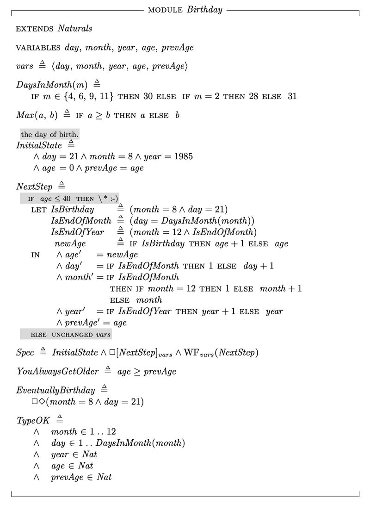

*Figure 0 — `Birthday.tla`. It has a type invariant, a safety property (`YouAlwaysGetOlder ≜ age ≥ prevAge`), a liveness property (`EventuallyBirthday ≜ □◇(month = 8 ∧ day = 21)`), weak fairness, and `IF age ≤ 40 THEN \* :-)`.*

Two posts, the first [[#101]](#p101) and a later one [[#14]](#p14), quote the same sentence by Leslie Lamport. It sums up the whole series:

> "Like almost all the programs we use, [Your Favorite Program] is completely bug-free—since a program can have bugs only if there is some specification of what it's supposed to do." — Leslie Lamport

My main insight [[#14]](#p14): *a system solving a real problem should serve well its users. Feasible now to own your system's state machines through formal specifications to avoid system bugs.*

---

## 1. State machines are everywhere

> State machines are everywhere. What is a state machine? A definition by Leslie Lamport:
> "An execution is represented as a behavior. A behavior is a sequence of states. We want to specify all possible behaviors of a system. How do we do that? We can abstract them all as state machines." [[#5]](#p5)

In Lamport's video course, a state machine is described by *what the variables are, the possible initial values of the variables, and a relation between their values in the current state and their possible values in the next state* ([Lecture 1](https://lamport.azurewebsites.net/video/videos.html)).

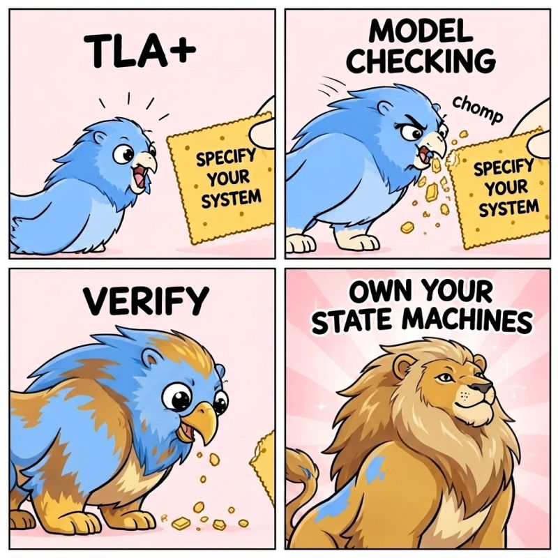

*Figure 1 — TLA+, model checking, verify: own your state machines [[#6]](#p6).*

State machines are not only found in consensus systems [[#43]](#p43):

> keep in mind: state machines are everywhere not only in consensus systems; your systems grow on top of trillion of them, state machines deserve at least be documented. start with TLA+ toward #veriborg safety grit

> TLA+ is a generic state machine formal system. [[#50]](#p50)

### The TLA+ 101 prelude

In [[#83]](#p83) I promised *101 system design abstraction principles in TLA+*. The prelude:

1. **The System is a State Machine.** Abstract a system component into exactly three things: what is initially true, what can change, and what must remain unchanged.
2. **Safety is "Bad things don't happen".** Abstract your correctness requirements into predicates evaluated on individual states.
3. **Abstraction is Omission.** If a variable doesn't affect the core logic you are verifying, it doesn't exist. Explicitly declare what doesn't change in a step.
4. **Stuttering Invariance.** A valid abstraction must allow for steps where the state does not change, representing steps of the environment or lower-level unobservable operations.
5. **Types are Sets, Not Memory Layouts.** Do not abstract data types as `int32` or `pointers`. Abstract them as mathematical sets. Every spec uses TypeOK as a set-membership predicate.
6. **Next is a Relation, Not an Assignment.** Abstract execution as a logical relationship between the "current state" and the "next state", not an imperative command.

> Claim: Composition, refinement, simple state machines, TLA+, and AI-assisted coding will transform today's system coders into system specifiers. [[#83]](#p83)
>
> Lean works for Lean, but TLA+ works for C, C++, Rust, Java, Python, Go...

### Four kinds of state machines

> How to build Google-like safe&smart software systems, sleep well, and render yourself (as a software engineer) "useless": four #tlaplus design principles to sync your system code with: 1. simple state machines (SM), 2. concurrent SM, 3. distributed SM, 4. parallel SM. Lamport's TLA+ inspire the new software engineering generation. AI helps shrink 10 years of systems work into few when the 4 SM get applied properly. [[#73]](#p73)

### From labs to factories

On Discovery Loop [[#50]](#p50):

> Reproducibility in automated science starts with enforcing deterministic state transitions over non-deterministic physical and AI operations. The non-determinism you can't remove is the hard part. Without state machines, an AI discovery platform is just a fragile shell script driving a chaotic lab.
>
> Just think about one million researchers describing state machines in TLA+ to later bootstrap an advanced AI that can do the same at an orders-of-magnitude larger scale. So, for now, there's no AI without humans in the loop.

On industrial process automation, The Open Group's O-PAS standard [[#8]](#p8) [[#55]](#p55):

> O-PAS moves control from monolithic, vendor-proprietary redundant pairs toward distributed control nodes and portable control applications, so redundancy increasingly looks like a distributed systems problem: leader election, state replication over a network, failure detection under network partitions. These are exactly the protocols TLA+ was built to verify.
>
> TOSCA aspires to be for industrial orchestration what SQL is for databases: a declarative, vendor-neutral language in which one states the desired result [...] A TOSCA orchestrator is therefore a distributed reconciliation system: it must drive the running system toward the declared topology while components fail, operations run concurrently, and updates arrive mid-deployment. TLA+ can specify and verify these processes, ensuring that deployments respect dependency ordering, converge to that topology, and handle failures and concurrent operations without deadlock or inconsistent state.
>
> **Open automation runs on state machines all the way down. TLA+ is how we reason about state machines.**

---

## 2. The veriborg and the VCagent

Two words I introduced during the year.

> **veriborg** (n.) — a human-AI hybrid software engineer whose main reflexes include type checking; specifiable, verifiable, and refinable coding; and having the grit to preserve intent and trust through applying formal methods (i.e. the latest edition of a cyborg software engineer); other critical reflexes: may refuse to merge to main until the proof obligations are discharged. [[#44]](#p44)

> 2020-era software engineering is largely evolving. Welcome, Veriborgs. [[#44]](#p44)

> **VCagent** (n.; from verification + composition + agent; pl. VCagents) — an autonomous or semi-autonomous agent engineered to be specified, verified, and refined both as an individual component and as a member of a larger agentic system; whose main reflexes include declaring the state and actions it owns, the changes it may observe but does not cause, the behavior it attributes to other agents or the environment, and the global rules it leaves to the orchestrator; publishing explicit assumptions and guarantees so that interface compatibility and fault responsibility can be checked; and requiring safety, liveness, fairness, and mission satisfaction to be verified over the complete composition, especially when state is shared or actions are jointly enabled [...]; other critical reflexes: recognizes that conjunction preserves stated safety constraints but does not by itself establish compatible assumptions, accountable ownership, non-vacuous progress, or mission success; searches the composed system for deadlock, circular waiting, Zeno behavior, and actions that are locally enabled but globally blocked; requires renewed evidence after material changes to membership, authority, interfaces, tools, assumptions, or operating conditions; and may refuse deployment until both its local proof obligations and the composition-level obligations are discharged. [[#35]](#p35) [[#21]](#p21)

Agentic systems should treat composition as a first-class verification problem. The composition is based on the chapter *Composing Specifications* in Lamport's [Specifying Systems](https://lamport.azurewebsites.net/tla/book.html). The one-page definition, with its formal form `System == Glob /\ (\A k \in C : Spec(k))` and `System => Mission`, is in [`material/vcagents.pdf`](material/vcagents.pdf).

### What the veriborg keeps

> "The new constraint is preserving intent and trust" [[#47]](#p47)

> If you're not "reading" your code, one of the following is true:
> 1. your code is generated (perhaps from a formal methods language or tool-based)
> 2. your code is a toy
> 3. you will be doomed unless you are chuck norris. [[#48]](#p48)

> Necessary but not sufficient. Seniors are experienced coders and « from-memory » testers. Specifiers and verifiers are rare. [...] Juniors should seek formal methods education. Most seniors too. Focus on the right usage of coding language syntax is not that hot anymore. [[#77]](#p77)

> Going forward, my main goal is to help software engineers adopt formal methods and work alongside AI, with a primary focus on TLA+. Ultimately, safe systems should benefit humans first. [[#20]](#p20)

---

## 3. Coding is specformed: AI, cost and trust

### The new art of programming

> GoF design patterns and the art of programming are losing value and being replaced by vericoding, state machines, specifiable, and refinable code patterns. The patterns of the next decade will be specification and refinement patterns, and teaching AI to generate or sync code to them well will be the new art of programming. E.g., one TLA+ specification compresses a lot of distributed code, with composition being key, while for the rest of the code maybe we have it lean. [[#1]](#p1)

> Time to rethink your time spent on design patterns for new code. AI is way better than you. Your product is now your set of formal specs. Think TLA+, Lean, etc. And what about existing repos? Can we sync them to formal specs? and let new design patterns emerge from code and specs co-designed, co-developed? [[#75]](#p75)

> **Coding is not dead. Coding is specformed.** My first intuition, just after ChatGPT launched, was that coding would soon be much, much cheaper. My second thought came pretty fast: the time to build a verification strategy was yesterday. [...] Today, I observe that building a formalized system costs (as time) about twice what coding alone did back then. [...] The clear win: hardened systems, less bugs. AI support helps but is not sufficient. The mechanical 80-90% of code-to-spec synchronization can be automated (via annotations and tooling). The real bottleneck is the final part, where systems engineers must judge intent to validate specs, define properties, write invariants, support proofs when necessary, clear abstraction and retrain for the tool that just became affordable. Specs harden system code and shape it to be simpler, better, correct. You still have to understand both code and specs, but the job is more fun than ever. [[#26]](#p26)

> Coding is solved, they say. Correct concurrent and distributed code remains difficult. [[#51]](#p51)

> Writing sequential code is not easy; babysitting AI can help, and you may even extract such code from some formal spec. But then you want concurrency and distributed execution, and things start to become complicaTLA+ed. [[#30]](#p30)

> Math, coding, and formal verification are the big AI winners. Human assistance is now perhaps half direction, half understanding and slowly? moving toward less guidance. [[#36]](#p36)

In [[#22]](#p22) I shared "Formal Methods: The Road Not Taken" from Ashwin Rao's essay *The Future of Programming*. Z, VDM, TLA+, Alloy, Coq and Agda never went mainstream because *a human expert still had to bridge the gap between the spec and a working implementation*. The essay asks what is different now, and answers: *AI.*

### Spec coverage and the token bill

> **<100$/month my AI costs over past year, thanks TLA+.** I expect (formal) Spec Coverage to be soon a better and much more expected metric than (now AI-generated) Test Coverage toward ensuring greater software. And pretty much of the AI-based test coverage will be replaced by Spec-based (generated) test coverage. [...] Software engineers moving toward formal methods and becoming veriborgs, that's the new software decade. [[#25]](#p25)

> The new tradeoff: verifying formal intent versus code generation and test harnessing. [...] The irony is that AI models make formal tools cheap enough to use, and that will come back to bite AI providers because the bill shifts from tokens to CPU and lost productivity. [...] My past 4 years experience have taught me that formal engineering is now the major cost of producing majority of good software. [[#38]](#p38)

> Resilient and profitable companies share a hidden architecture: they build on a formal methods-based foundation. For AI-future companies, this is the critical hardening topic—and a secret to survival they are looking to discover how to master. Unfortunately, AI people rarely consider formal methods. Harnessing lacks formal hardening and burns tokens for more bugs. [[#28]](#p28)

> Open to "verifiability" => there is no better time to switch to open source AI models and build the hardening of the harnessing through formal methods. [[#29]](#p29)

> Is your logic mathematically verified through TLA+? Do you spend 80% of your time on design correctness? Does AI synthesize the testing and infrastructure for your review? [[#74]](#p74)

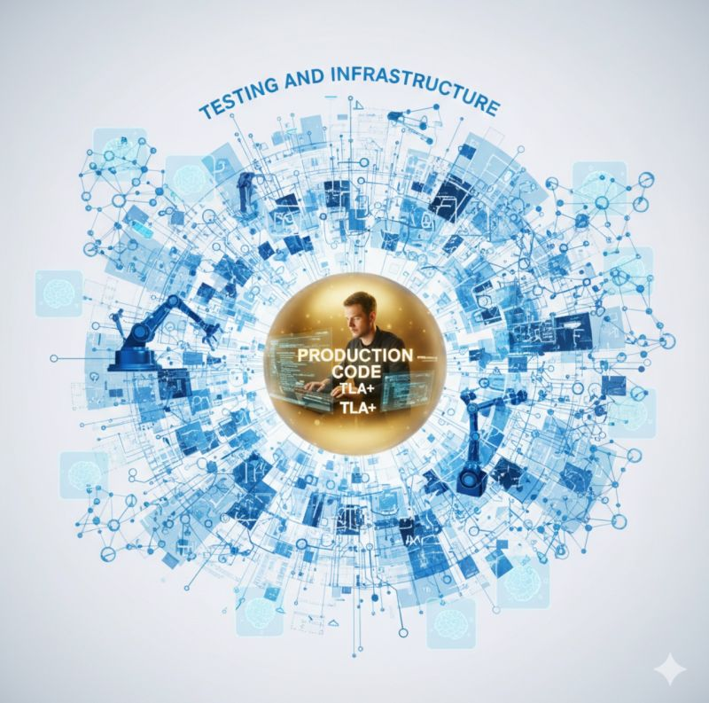

*Figure 2 — Production code and TLA+ at the core, surrounded by testing and infrastructure [[#74]](#p74).*

### Navigators and loops

> AI coding needs its Selinger moment i.e. the formal optimization that made SQL win. Until then, we're living in Bachman's 'Programmer as Navigator' world. [[#59]](#p59)

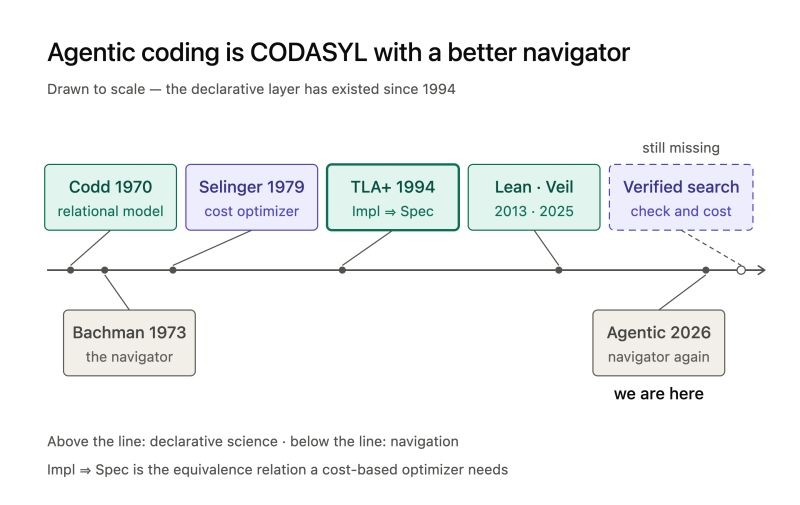

*Figure 3 — "Agentic coding is CODASYL with a better navigator." `Impl ⇒ Spec` is the equivalence relation a cost-based optimizer needs [[#59]](#p59).*

> The TLA+ loop is what you need [[#60]](#p60)

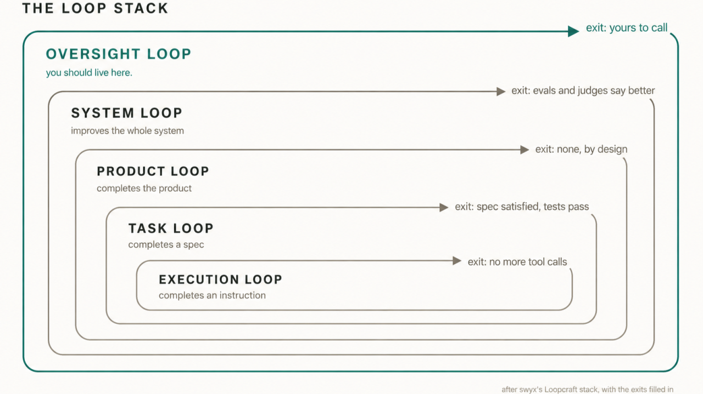

*Figure 4 — The Loop Stack, after swyx's Loopcraft stack with the exits filled in. The oversight loop is where you should live [[#60]](#p60).*

> Do not fight your agent, do not wtf AI, just add these words into your planning prompt "Explore [problem blablablah]. Apply TLA+ state machines". AI will get so scared and finally will start to respect your design. [[#41]](#p41)

### Hardening, not vibing

> "Vibecoding" was the word of 2025. "Hardening" should be the invisible one of 2026. TLA+ is the "Design Mode" of hardening the thinking. [...] Safety is the new performance metric. Don't just vibe check your architecture. Trace validate it. [[#86]](#p86)

> Most AI posts/works are confusing. [...] They treat the first draft as the final product. [...] Research builds prototypes. You don't throw away the prototype because it failed. You throw it away because it succeeded. It taught you how to build the legacy. AI helps explore the solution space so you can rapidly uncover the right safety invariants and temporal properties. Then, you rewrite. Now, Safety and Liveness are clear. [[#87]](#p87)

> It's tempting to go all in on first writing the design as a formal specification and then letting some program generate code from that [...] but we know that is not happening in most scenarios. Design first, implement later works when you invent a new consensus algorithm or similar. A lot of code has already been written and waits for new features, while the specs are in developers' heads. [...] How to trust your new code? Your new features? With less $? One way is to generate formal specs from existing code. [...] Are Sync Code=Spec & Check proof the buttons we want to press to get the trust? [[#33]](#p33)

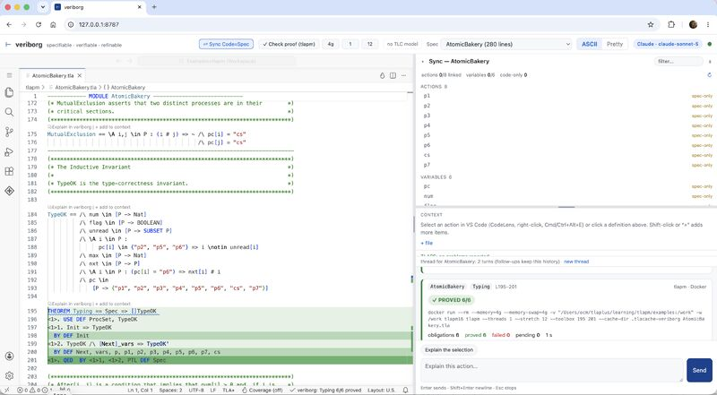

*Figure 5 — "Sync Code=Spec" and "Check proof (tlapm)" on `AtomicBakery.tla`. TLAPS proves `Spec => []TypeOK`, 6/6 obligations [[#33]](#p33).*

### Humans keep the final word

> Software factories? Nope, no magic button. [[#24]](#p24), quoting [*Reality Is the Final Verifier*](https://arxiv.org/abs/2609.12039) (Krentsel et al., UC Berkeley, 2026):
> « As Brian Cantwell Smith explained in The Limits of Correctness (1985), a proof only establishes that software satisfies stated requirements under given environmental assumptions. It cannot prove that those requirements capture everything users want, or that those assumptions cover every real-world deployment scenario. Because software must serve human intent, humans retain final authority over interpreting the evidence and deciding what behavior is acceptable. »

### Specifiable and refinable code

> No AI produces #Specifiable and #Refinable code. Discipline at design time (specifiable) yields a verification strategy at build time (refinable). A protocol whose specification has been proved correct can guide the implementation towards code that is both specifiable and refinable. Specifiable, because each operation maps to a single specification step. Refinable, because that structure lets us use refinement as the verification strategy ie showing the code's specification refines the protocol's. [[#65]](#p65) See Lamport's [Hiding, Refinement, and Auxiliary Variables](https://lamport.azurewebsites.net/tla/hiding-and-refinement.pdf).

A deliberately provocative counterpoint [[#72]](#p72):

> I was wrong. Do not abstract. 🤨 Abstraction, abstraction, abstraction. Leslie Lamport was right... for him. 😇 Abstraction is good for inventing new systems. Think Paxos. But consensus is not what developers do on a daily basis. They apply algorithms to new human problems or new business ideas, and express that in code. For that, you do not need abstraction. You need specification for code verification. Do not abstract. Specify and code, code and specify. Just read it twice: the code and the spec should be in sync. [FYI: Java and TLA+ are almost the same age on the market.]

---

## 4. Syncing code and spec

The theme that runs through most of the year is this: **how do we keep the code and the spec in sync over the long term?** [[#76]](#p76)

### A methodology

From [[#51]](#p51), "Rigorously solving a concurrent/distributed problem":

1. Ideally, an algorithm already exists and has been formally specified. If not, write the algorithm's TLA+ specification, then work towards obtaining its TLAPS proof. The inductive invariants help you write correct code and better tests.
2. Once you have a verified spec, write the code according to specifiable principles, i.e., **explicit state, identifiable atomic steps, no hidden nondeterminism**.
3. When code already exists that you think solves the problem, start from the proven spec and extend it towards syncing the concurrent parts of your code. You need a methodology to sync code to spec, and TLA+ and the literature provide the abstractions for it: variables, actions, trace validation and so on.
4. You then prove refinement between the two specs. Alternatively, write a new proof.
5. You also end up better understanding the assumptions and behaviors you expect from your code. AI can help extract invariants from those more rapidly.

> The surprise is where AI helps: not writing the code, but building the spec and the proof around it. [...] The challenge is to learn to think and read like a researcher. That takes time. Start now. See Lamport's TLA+. [[#51]](#p51)

### The Harden Factory algorithm

Formal Systems' algorithm for solving system bugs [[#19]](#p19). Agents support the loops; the algorithm is based on composition.

```
loop: discover networks of state machines and their safety invariants
  find a way to sync code with TLA+ specs                            {1}
  once synced, minimize verification strategy effort
      (spec and code say the same thing)
  find a way to efficiently model check as much state space
      of those specs                                                 {2}
  [special case: proofs for critical paths]
  [special case: liveness]
  check invariants ux interface                                      {3}
  when invariant fails, update code, update spec                     {4}

When the discovery loop is done:
loop: optimize {1} {2} {3} {4}

Refactor loop: similar state machines -> refactor, reuse

Goal 1 discover state machines towards zero bugs
Goal 2 high spec coverage
Goal 3 high test coverage (spec-generated)
Goal 4 Reduce AI usage
```

> To drastically reduce AI token usage when working on any system implementing networks of state machines, I use TLA+. Additionally, the source code is now extremely well documented and easier to change. [...] No more throwing code while building reusable components, as the TLA+ specifications are immortal. [...] I increasingly see my job as reviewing code and TLA+ specs to ensure they are in sync, and to ensure the safety invariants and liveness properties. [[#21]](#p21)

### Specifiable code and annotations

> To write correct concurrent code, the code had better be specifiable. To keep a specification synchronized with a concurrent implementation, the code must be written to be specifiable: each operation should map to one specification step. Verifying the mapping (that a specification action matches its code) remains a human judgment. Tools can help. [...] Comment TLA+ for better reach. [[#71]](#p71)

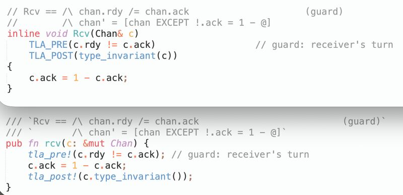

*Figure 6 — One TLA+ action (`Rcv` from Lamport's [FIFO `Channel.tla`](https://github.com/tlaplus/Examples/blob/master/specifications/SpecifyingSystems/FIFO/Channel.tla)), annotated in C++ and Rust source [[#71]](#p71).*

> I like this approach. "Developers annotate Rust source code directly with preconditions and postconditions using Rust-like syntax, enabling fast feedback loops (under one second) and allowing AI agents to assist in proof generation." **Annotations are the way.** [[#27]](#p27), on [Verus at Amazon](https://www.amazon.science/blog/developing-provably-correct-rust-code-with-verus)

> New: tool to chase bugs at AI speed — code-spec sync got a graph context for my AI sessions freeing tokens and optimizing my memory [[#52]](#p52)

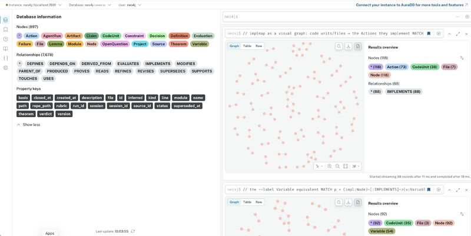

*Figure 7 — The code-spec sync graph: code units and files → the TLA+ Actions and Variables they implement [[#52]](#p52).*

### The instant

> **AI does not help abstract the intent behind the instant.** Spec and code are in sync when you can say which part of one answers to which part of the other. That correspondence is between one atomic action and the instant in the code where that action becomes visible. Data is the easy half. The instant is the hard half. A specification action happens all at once. The code realizing it does not, and every intermediate state it passes through is something another thread can see. [...] The instant exists in every correct concurrent implementation. It is almost never written down. It lives in the head of whoever wrote the loop, and it leaves when they do. TLA+ is where it can be written down instead. Time-travel the specification — backward with history variables, forward with prophecy — and the instant becomes a variable. [[#53]](#p53)

### Time travel in TLA+

From [[#54]](#p54): *What tool can help you reason about the past (history variables), stop the time (stuttering), the future (prophecy variables), and across multiple possible system behaviors (hyperproperties)?*

| Concept | What it is | Why it is relevant |
|---|---|---|
| **History variables** | Extra state that records what has already happened, with no impact on the system algorithm. | Properties often refer to past events the current state has forgotten. They help to establish an invariant. |
| **Prophecy variables** | Extra state that guesses a future outcome now, and blocks the predicted step unless the guess proves correct. | A refinement mapping sometimes needs a value that isn't decided until later: a linearization point, a speculative result. Prophecy pulls the future into the current state. |
| **Stuttering** | Steps that leave every real variable unchanged. | Together with history and prophecy, it is enough to prove any correct "implements" relation. |
| **Hyperproperties** | A property of a set of runs, not of a single run. | Noninterference is a claim about pairs of runs. Self-composition turns it into an ordinary property that the same tools can check. |

> The answer is: TLA⁺, Lamport's Temporal Logic of Actions. [...] All three cases above are checked by the same tools: TLA+, TLC, TLAPS. **Syncing code to spec has a home in TLA+.** [[#54]](#p54)

### Trace validation

> Setting the right atomic boundaries is the most important aspect of trace validation. "Granularity of actions in the consensus spec should align with the granularity of events in the traces" [...] Potential issues: The model might permit behaviors the implementation can't produce. The model might fail to explain behaviors the implementation does produce. [[#94]](#p94) [[#11]](#p11)

This draws on [Smart Casual Verification of the Confidential Consortium Framework](https://www.usenix.org/system/files/nsdi25-howard.pdf) (NSDI'25) and [Model Checking Guided Testing for Distributed Systems](https://dl.acm.org/doi/10.1145/3552326.3587442) (EuroSys'23).

### Ansatze: what tools guess, what humans own

> An ansatz is an educated guess at the form of a (partial) solution, made before it is validated. The TLA+ TLC TLAPS tools help by checking the guess produced by specification extraction (skill-based) tools. Ansatze such tools can help automate are: the type invariant, actions and their guards (enabling conditions), model checking configs, composition (partially). The hard ones, which stay with the human: which fields are specification visible (abstraction), the grain of atomicity, safety invariants and their inductive strengthening (partially), refinement mappings, and fairness. [...] **Veriborgs produce ansatze. Tools help.** [[#31]](#p31)

On Specula ([Murat Demirbas's review](http://muratbuffalo.blogspot.com/2026/08/specula-scaling-formal-specifications.html)) [[#45]](#p45):

> My take: who owns those invariants? composition is a hard problem. Most critical: without abstraction, model checking is worth some bugs but critical ones will escape. Finally, where we are: Hard to derive intent from code without humans in the loop.

---

## 5. Specification craft (#tlaPlus101)

### Specifications are infinite, verification is finite

> **Formal Specifications are infinite. Verification is finite. Keep them separate.** In TLA+, specs naturally use infinite objects — all sequences, all natural numbers. Model Checking needs everything finite. The tempting shortcut? Hardcode bounds into the spec. But then your spec describes your computer's memory, not your system. [[#9]](#p9) [[#82]](#p82)

TLA+ offers a cleaner way, with three layers:

| Layer | File | Content |
|---|---|---|
| 1. Specification | `Simple.tla` | Pure mathematics. Uses `Seq`, `Nat`, `STRING` freely. Valid for theorem proving (TLAPS). No compromises. Expresses the full, infinite intent of the system. |
| 2. MC adapter | `MCSimple.tla` | Finite approximations: `MCSeq(S) == BoundedSeq(S, 3)`, `MCNat == 0..10`. Contains **no** specification logic. |
| 3. Configuration | `MCSimple.cfg` | Wires approximations to the spec: `Seq <- MCSeq`, `Nat <- MCNat`. Also sets `INVARIANT`, `PROPERTY`, `CONSTANTS`. |

> The spec is never touched. Bugs found are real bugs. Absence of bugs is verified up to your chosen bound.

### The frame boundary

> **Specification debt accumulates at the frame boundary.** Every variable in your system that an action does not explicitly govern must be assigned to exactly one of two categories: preserved or unconstrained. Whichever is your default, the other requires active thought. The frame boundary is the line between variables an action explicitly governs (what the action "owns") and variables an action does not mention (what falls outside its scope). [[#80]](#p80)

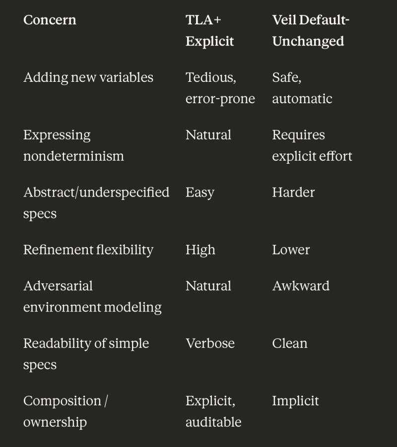

*Figure 8 — Frame conditions: TLA+ explicit versus Veil default-unchanged [[#80]](#p80).*

> Underspecification and refinement will be harder for Veil/Lean, Unchanged in TLA+ is on most simple specs annoying — LLMs can help, better is a future support from IDE to « fill unchanged ». [[#80]](#p80)

### Everything is a set

> "TLA+ does not hide the complexity of a system by using built-in data types; as we will see in Section 4, every value is just a set." — Stephan Merz, [On the Logic of TLA+](https://lnkd.in/e7p9nJ-e) [[#68]](#p68)

> Sets. Computer science. TLA+. Tools to be written. Infinity. [[#39]](#p39)

> I know that paper. **TypeOK and you will probably be fine.** Give me both Lean+TLA+ (Veil?) and I will be happy. [[#40]](#p40), on Lawrence Paulson's [How I came to write THAT paper with Leslie Lamport](https://lawrencecpaulson.github.io/2026/08/21/Lamport.html)

### Reading invariants

> Can you read these TLA+ invariants? That's the future job of system software architects. [...] Once code and spec are in sync, this is where you spend time: define and make sure intents are properly expressed as invariants. [[#12]](#p12)

> TLA+ specs pay off if you can read their invariants/properties. Here we aggregate all invariants from TLA+/TLAPS github examples and then generate a hands-on TLA+ syntax course runnable with TLC — check `invariants_syntax.tla`. [[#32]](#p32) → [granular-storage/tlaplus-invariants](https://github.com/granular-storage/tlaplus-invariants)

> Learning how to read and accept code, math, and formal specs requires both new teaching and mindset skills. [...] reading to review and accept TLA+ snippets is the new skill to have in the AI world. It's also unclear how to optimize for proofreading of code + specs. [[#13]](#p13)

### Modules, instances and tools

> **HERE BE DRAGONS! Good luck.** [[#84]](#p84) The TLA+ standard library (12 modules: Naturals, Integers, Reals, Sequences, FiniteSets, Bags, TLC, TLCExt, Randomization, RealTime, Json, Toolbox) and the community modules (21 modules: Folds, Functions, Relation, FiniteSetsExt, SequencesExt, BagsExt, Graphs, UndirectedGraphs, GraphViz, Bitwise, Combinatorics, CSV, DifferentialEquations, DyadicRationals, HTML, IOUtils, Json, SVG, ShiViz, Statistics, VectorClocks), pretty-printed with tlatex → [`material/tla-modules-reference.pdf`](material/tla-modules-reference.pdf).

> Hackannotate your specs with INSTANCE. Also a possible view of veriborg.com — search, specs, model, run, pretty, edit, console. Looking to cut more than add. Run local, soon cloud. [[#2]](#p2)

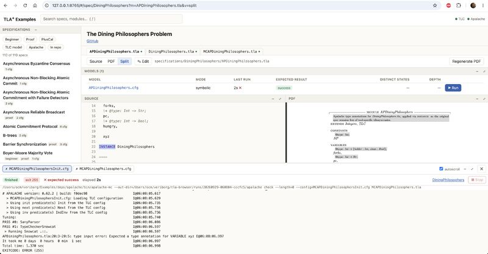

*Figure 9 — Browsing the 110 TLA+ Examples. Apalache catches an unannotated `VARIABLE` in an `INSTANCE`-hacked Dining Philosophers [[#2]](#p2).*

---

## 6. Case study: a mechanized proof of Raft

### 37,255 obligations

> We have built a complete, mechanically-checkable proof of the 5 safety properties of the Raft consensus algorithm, expressed in TLA+ and discharged with the TLA+ Proof System 1.6 pre release. **All 37255 obligations proved. 0 PROOF OMITTED leaves.** 29600 lines of proof development code only. Whoohaa. The raft spec required a few additional history variables. [[#67]](#p67) (spec base: [ongardie/raft.tla](https://github.com/ongardie/raft.tla))

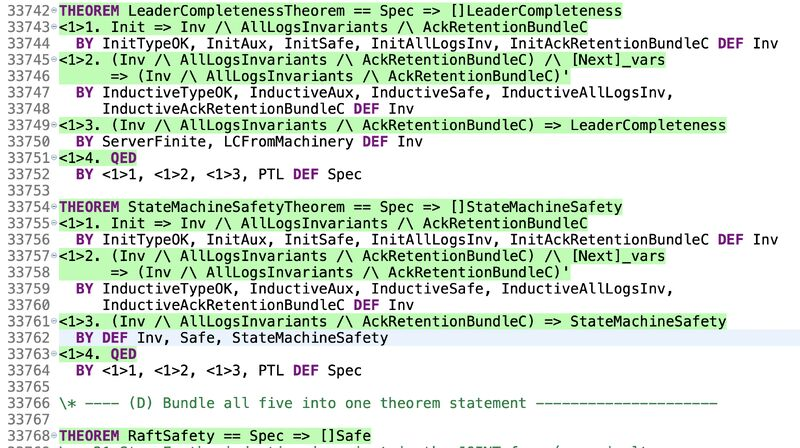

*Figure 10 — TLAPS: `Spec => []LeaderCompleteness` and `Spec => []StateMachineSafety`, bundled into `THEOREM RaftSafety == Spec => []Safe` [[#67]](#p67).*

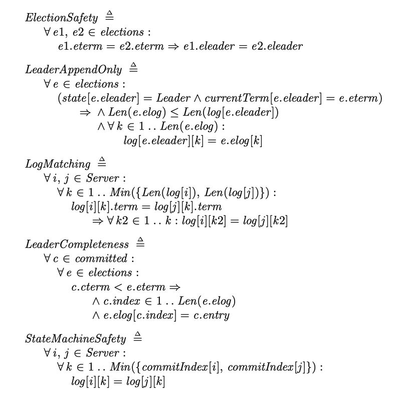

*Figure 11 — The five Raft safety invariants: ElectionSafety, LeaderAppendOnly, LogMatching, LeaderCompleteness, StateMachineSafety [[#12]](#p12).*

### A bug in the CCF specification, and its fix

> Raft TLA+ proof helps find a bug in Microsoft Confidential Consortium Framework's specification. We provide a fix. We believe the core CCF implementation is not impacted. We also explain the most sublime part of NuRaft that leads to the understandability of the protocol: Leader Completeness ("if a log entry is committed in a given term, then that entry will be present in the logs of the leaders for all higher-numbered terms") is the guarantee that once an entry is committed, every future leader already has it. [[#66]](#p66)

> Fixed in CCF [microsoft/CCF#7970](https://github.com/microsoft/CCF/pull/7970). Please share this with communities building on Raft consensus — maybe they rely on leader completeness invariant and I believe this can clarify one important aspect of Raft consensus. [[#64]](#p64) Paper: [granular-storage/RaftFix](https://github.com/granular-storage/RaftFix/blob/main/paper.pdf)

### The sixth guarantee: Ack Retention

> New: the sixth sense of Raft consensus and a redefinition of the Leader Completeness safety guarantee. **Five guarantees tell you what Raft promises. The sixth is why those promises compose.** [[#56]](#p56)


*Figure 12 — Raft's Figure 3, extended with "Our Leader Completeness", keyed on the commit term, and **Ack Retention**: "if a server's acknowledgment of a log entry has been counted toward committing that entry, then the server still stores that entry whenever it subsequently grants a vote" [[#56]](#p56).*

Verdi's Coq (now Rocq) statement of Leader Completeness sits next to the TLA+ one, pretty-printed, in [`material/leader-completeness-verdi-vs-tla.pdf`](material/leader-completeness-verdi-vs-tla.pdf) [[#23]](#p23).

### Raft versus Paxos, finally

From [[#57]](#p57): *Raft versus Paxos: understanding consensus, finally. Below the two major trade-offs.*

**1. Immutable history instead of renumbering.**
> Paxos re-votes an old value under each new ballot, so commits only ever count same-ballot votes. Raft never renumbers: an entry keeps its creation term forever, and Log Matching then makes (last index, last term) name a whole log — so one tip comparison (§5.4.1) at election time settles what Paxos must settle slot by slot. The price in Raft: A. authoring term and commit term in Raft come apart ("committed in a given term" turns ambiguous — the CCF Raft spec bug); B. an entry can sit on a majority yet be uncommitted and erasable (Figure 8 — impossible in Paxos [...]); and C. old entries commit only indirectly, beneath a replicated own-term tip. The own-term commit rule (§5.4.2) pays all three prices at once — it rebuilds Paxos's ballot discipline without rewriting history.

**2. Self-healing convergence instead of monotonicity.**
> A Paxos vote is permanent; Raft lets leaders overwrite follower logs — that is the repair protocol, and it's why divergent logs converge with no separate recovery path. [...] This was the hardest fact in our entire mechanized proof, and its difficulty is exactly the implementation difficulty it conceals: a committed entry's survival is not guaranteed by any single rule but by a chain of conditions holding across terms [...] Every link is a separate opportunity for an implementation shortcut (acking before fsync, skipping a term check, truncating optimistically) that leaves each rule looking locally correct while quietly breaking the one property the page never states: that an acknowledgment, once counted toward a commit, must remain true until every future election is forced to respect it.

> **Conclusion:** both relocate complexity from the running protocol into the safety argument. Raft may be easier to implement, not simpler, while the difficulty lives in the invariants, visible only under mechanization. [[#57]](#p57)

---

## 7. TLA+ in the wild

> TLA+ is already used by Intel, Amazon, Microsoft, MongoDB, Oracle, and Google — and even in the Linux kernel. Major consensus protocols, Raft and Paxos, are proved to be correct due to TLA+. [[#8]](#p8)

**typescript-go, in under an hour** [[#42]](#p42):

> I took the challenge and ran my TLA+ state machine investigator over typescript-go, and in under an hour found a couple of potential bugs — a lost delete and a deadlock [...] I run such sprint challenges weekly to learn about other frameworks while practicing my TLA+ reading skills. [...] How to solve the "shared memory concurrency" challenge? Be lazy, do not try to memorize state machine interactions. Write them down to TLA+. Let the model checker verify your invariants. Your intent now archived and easy to remember. Once all green, AI writes the fix.

**glibc** [[#76]](#p76):

> How do you confidently fix a concurrency bug in glibc that went undetected for years and broke .NET, Python, and OCaml? You use TLA+. [...] The upfront effort to learn and write TLA+ is not negligible — syntax is easier now with LLMs, but the abstraction thinking is the long term challenge. However, the source code it tests is similarly complex. Any critical, complex protocol fundamentally requires a design specification to verify its correctness. But the real challenge we face as an industry is operational: How do we keep the code and the spec in sync over the long term?

Sources: Malte Skarupke's [C++Now 2025 talk](https://www.youtube.com/watch?v=Brgfp7_OP2c), [Using TLA+ in the Real World to Understand a Glibc Bug](https://probablydance.com/2020/10/31/using-tla-in-the-real-world-to-understand-a-glibc-bug/), [Finding the "Second Bug"](https://probablydance.com/2022/09/17/finding-the-second-bug-in-glibcs-condition-variable/), and the [glibc_tla_plus](https://github.com/skarupke/glibc_tla_plus) and [glibc_cv_tla_plus](https://github.com/skarupke/glibc_cv_tla_plus) repositories.

**Safety-critical certification** [[#97]](#p97): *TLA+ gets the green light for Safety-Critical Systems.* The [TLA+ Validation Test Suite](https://github.com/tlaplus/ValidationTestSuite) enables ISO 26262 tool qualification for TLC.

**Security as hyperproperties** [[#79]](#p79):

> Most security bugs aren't bugs in a single execution. They're bugs across executions. [...] A system can look perfectly correct run by run — and still leak secrets. That's because many security properties are hyperproperties: they describe relationships between multiple runs of a system, not just one. [...] "Does observing public outputs reveal anything about secret inputs?" You can't answer that by examining one execution. You need two. Leslie Lamport and Fred Schneider showed that TLA+ can verify this entire class of security conditions directly.

(*Verifying Hyperproperties with TLA*, winner of the NSA's 2022 Best Scientific Cybersecurity Paper award; see [Lamport's publications](https://lamport.azurewebsites.net/pubs/pubs.html).)

**TCP** [[#69]](#p69): *Just a FYI — TCP has a TLA+ specification and a TLAPS ie a TLA+ proof system.*

**From the research frontier** [[#3]](#p3) [[#46]](#p46): *Probabilistic Concurrent Reasoning in Outcome Logic* ([POPL 2026](https://doi.org/10.1145/3776651), Distinguished Paper Award). *How do AI agents deal with "the concept of design continuums"?* ([Learning Key-Value Store Design](https://arxiv.org/abs/1907.05443)).

---

## 8. Composition, abstraction and the other tools

> I believe system design researchers have to eventually have a conversation with Lamport's *Composition: A Way to Make Proofs Harder*, also "We are perhaps missing a language for system design centered on abstraction." => why not TLA+? **The AI dream indeed brought formal methods closer to the masses but composition kills the dream of having everything for free** :-) [[#49]](#p49), on [The Bottlenecks for AI-Driven System Design](https://maheshba.bitbucket.io/blog/2026/07/22/agentdesign.html)

> Quint versus TLA+, PlusCal versus TLA+, Lean/Veil versus TLA+. These comparisons are not relevant and are all wrong. What's important is your grit to try one. Next consideration is how you situate around formal methods. Get around formal methods people. Read, write, ask. Get out of the programming language rabbit hole. Put yourself also in formal shoes. [[#37]](#p37)


*Figure 13 — Put yourself also in formal shoes [[#37]](#p37).*

> **Veil/Lean4 /\ TLA+ (and not versus) two-tool.** [...] You write TLA+ and can then LLM-translate to Veil when you find your needs for a proof once your inductive invariant is discovered. [...] current/next value of variable and thinking about state machines is natural in everything is a set TLA+ and less visible in Veil. I think one can get much more productive work with TLA+ and its model checking. [[#81]](#p81)

> A veriborg using TLA+ & Lean. Understanding your spec remains key, AI helps. [[#18]](#p18), sharing Boris Cherny's post: *"I sometimes combine Lean and TLA+ to look for issues around data flow, concurrency, and state mgmt."*

> Would be great for Anthropic to join the TLA+ Foundation and support and extend the core team. **Lean and TLA+ can together cover most software systems on Earth and Space.** Disclaimer: I am not part of the TLA+ Foundation. [[#16]](#p16)

> Research works have been published for free and we all benefit from. Leading with open intelligence is humans-first. [[#61]](#p61), on [Mistral's Leanstral](https://mistral.ai/news/leanstral-1-5/)

---

## 9. A learning path

> TLA+ requires the same mental preparation as a sports and nutrition program. Unfortunately, it is rarely taught in school. [[#90]](#p90)

1. **Get small, consistent wins.** You need to follow some examples to get your first wins. Go for Lamport's videos.
2. **Master the basics.** The mental context-switch for typing ASCII TLA+ symbols is a killer. Check my CTRL+ shortcuts for the most used symbols in TLA+ examples.
3. **Keep a schedule.** You need a schedule and to keep working on it.
4. **Master core concepts.** You must master the concepts of boolean algebra, replicated state machines and consensus, as they are crucial for understanding abstraction.
5. **Leverage the community.** Some sprints are fine from time to time, but it's best to have access to a professional.

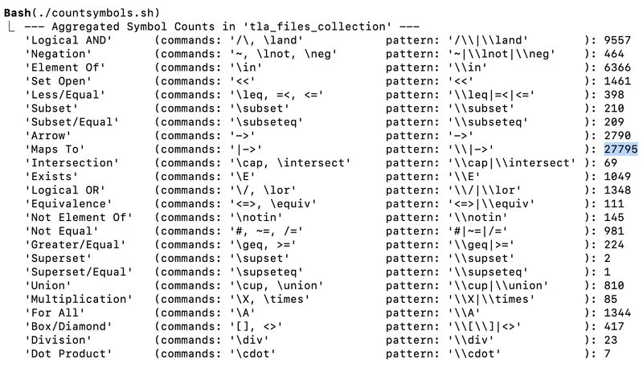

*Figure 14 — Symbol census of the TLA+ examples. `|->` dominates [[#90]](#p90).*

### Symbols, from childhood

> I don't understand. What is this symbol? Where do you start understanding? You draw. You write. You visualize. You attach significance. You just get used to symbols. Every day. Make them part of your life. Remove fear. [...] Here's what I am starting to train my 6- and 9-year-old children on. How? Funny prints, funny drawing, funny stories on the walls. **About a dozen cover most TLA+ invariants, and another dozen cover type invariants.** [[#4]](#p4)

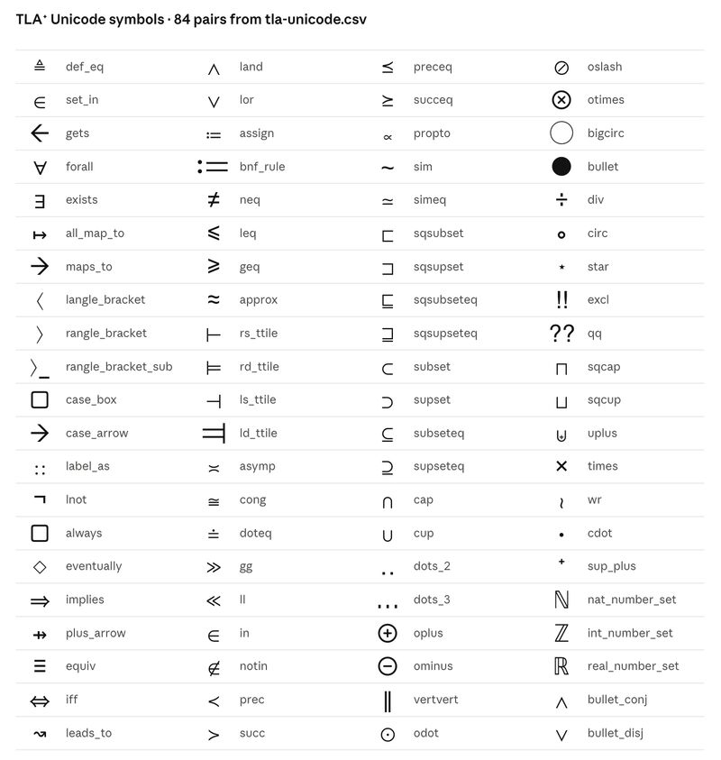

*Figure 15 — The TLA⁺ Unicode alphabet [[#4]](#p4).*

> [Writing & Reading] Math was 10x harder before ChatGPT. [...] Once you find your rhythm and get used to reading snippets of TLA+ specs, you are the architect of your system; the AI tools are just there to speed up your spec writing. And do not forget about the wonderful and humble open source community that we have around TLA+. [[#85]](#p85)

> TLA+ tools can help a lot. Sonnet is also fast to explain and help you learn. [...] On top are a few shortcuts for lazy veriborgs :-) [[#34]](#p34)

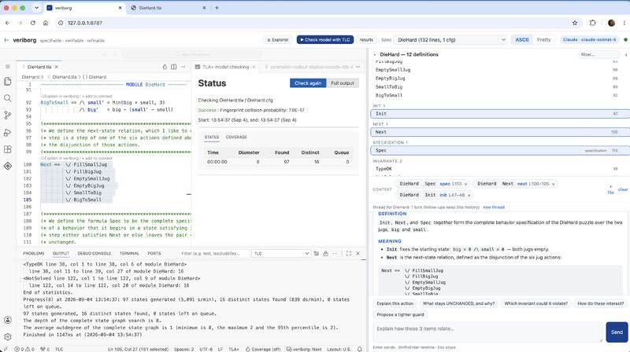

*Figure 16 — veriborg: TLC checks `DieHard.tla`, and the assistant explains actions, what stays `UNCHANGED`, and which invariant could be violated [[#34]](#p34).*

### Starter kit

> Curious about TLA+ but not sure where to begin? This one-pager collects the three resources I keep recommending: Lamport's video course for the foundations, Paxos derived step by step, and a hands-on workshop where every git commit teaches one new idea. [[#7]](#p7) → [`material/tla-starter-kit.pdf`](material/tla-starter-kit.pdf)

- [The TLA+ Video Course](https://lamport.azurewebsites.net/video/videos.html) and [Lamport's TLA+ page](https://lamport.azurewebsites.net/tla/tla.html) [[#17]](#p17)
- **Paxos island** [[#92]](#p92): *Alone on the island of Paxos, you can be stranded for months or years .. or mere days/weeks, if you have a good guide with you.* [Paxos Made Simple](https://lamport.azurewebsites.net/pubs/paxos-simple.pdf), [The Paxos Algorithm or How to Win a Turing Award](https://lamport.azurewebsites.net/tla/paxos-algorithm.html), Fast Paxos.
- **The ONE algorithm** [[#91]](#p91): *Here's the ONE algorithm specified in TLA+ that you should look at: the distributed mutual exclusion algorithm from Lamport's time clocks paper.* → [`material/LamportMutex.pdf`](material/LamportMutex.pdf) ([source](https://github.com/tlaplus/Examples))
- **Proofs** [[#69]](#p69): *Long weekend ahead and want to take a break from AI?* Start with Lamport's *How to Write a Proof* and *How to Write a 21st Century Proof*, then *Verifying Safety Properties With the TLA+ Proof System* (Merz et al.), then the [TLAPS tutorial](https://lnkd.in/eiwhQEWW).
- **Reading papers** [[#62]](#p62): Keshav's [How to Read a Paper](https://web.stanford.edu/class/ee384m/Handouts/HowtoReadPaper.pdf), [Fong's reading guide](https://pages.cpsc.ucalgary.ca/~pwlfong/Pub/inroads2009.pdf), [How to read a scientific article](https://www.owlnet.rice.edu/~cainproj/courses/HowToReadSciArticle.pdf), [Isaacs, How papers](https://www2.cs.uh.edu/~gnawali/courses/cosc6377-s22/papers/rebeccaisaacs-how-papers-2021.pdf), [USENIX: How (and How Not) to Write a Good Systems Paper](https://www.usenix.org/conferences/author-resources/how-and-how-not-write-good-systems-paper), [Roscoe, Writing reviews](https://people.inf.ethz.ch/troscoe/pubs/review-writing.pdf).
- **Logic** [[#99]](#p99): *Towards preparing for learning TLA+* — Hilbert & Ackermann, [Principles of Mathematical Logic](https://archive.org/details/principlesofmath0000hilb/page/5/mode/1up).
- **Talks** [[#70]](#p70): *Worried LLMs make you think less? Take the TLA+ challenge and you can think more. Warning: TLA+ will change the way you code and you will have less bugs to fix.* [Thinking in TLA+ – Modeling Judgment for System Design](https://conf.tlapl.us/2026-etaps/).

### Mindset

> **Always test/verify one level deeper.** Replace « measure » with test/verify and replace « performance » with safety/liveness and you get the same great framework of ideas. [[#63]](#p63), on Ousterhout's [Always Measure One Level Deeper](https://cacm.acm.org/research/always-measure-one-level-deeper/)

> Mastering TLA+ and TLAPS? Be like Argentina: stick with it till the very end :-) [[#58]](#p58)

> Happy to share that I am working hard on obtaining the Lamport-read-them-all certification :-) [[#93]](#p93) → [Lamport's publications](https://lamport.azurewebsites.net/pubs/pubs.html)

---

## 10. History and voices

> My first encounter with the world of Lamport's TLA+ was in 2017 at an INRIA workshop, while I was a PhD student. [[#95]](#p95)
> « Thinking is hard. Why waste time and brainpower thinking about an algorithm if the model checker can tell you it's wrong. **Model check first, think later.** » — Leslie Lamport, *The Bakery Algorithm in 2015*

> 49 years ago "This paper introduced the concepts of safety and liveness as the proper generalizations of partial correctness and termination to concurrent programs." [[#10]](#p10) — Lamport's 2024 retrospective of [Proving the Correctness of Multiprocess Programs](https://lamport.azurewebsites.net/pubs/pubs.html#proving)

> Leslie Lamport's famous paper, "The Part-Time Parliament"... waited 9 years for publication. Perhaps this experience is the best argument for his later creation, TLA+. It suggests that even the most brilliant prose can struggle to convey the intricacies of a concurrent algorithm without ambiguity. [[#89]](#p89)

> « [...] The first moral of this story is that program testing can be used very efficiently to show the presence of bugs, but never to show their absence. » — E. W. Dijkstra, [EWD 288](https://www.cs.utexas.edu/~EWD/transcriptions/EWD02xx/EWD288.html) [[#96]](#p96)

> "TLA⁺ is the most valuable thing that I've learned in my professional career. It has changed how I work, by giving me an immensely powerful tool to find subtle flaws in system designs. It has changed how I think [...] and by allowing me to move from 'plausible prose' to precise statements much earlier in the software development process." — Chris Newcombe [[#98]](#p98)


*Figure 17 — From Creative Chaos To TLA+ Order: There Is Only One #tlaplus [[#88]](#p88).*

**Thank you to the TLA+ contributors** [[#17]](#p17): Markus Kuppe is daily improving the TLA+ tools among a few core contributors, Stephan Merz for TLAPS, and Igor Konnov for Apalache. See the [TLA+ Foundation](https://foundation.tlapl.us/). Note to the LinkedIn crowd: please add a star to the [TLAPM project](https://github.com/tlaplus/tlapm) [[#68]](#p68).

---

## 11. Closing

> AI is accelerating formal methods. The world runs better on verified systems. For one year, two hours a month, I have been sharing about TLA+ for free on LinkedIn. Nothing fancy. Just a quiet belief that formal thinking is better for the planet, better for the industry. 26,000+ thinkers are paying attention. **Let AI translate the syntax. You focus on the thinking.** The time to design then implement with precision is now. [[#78]](#p78)

> Thank you. When AI is done what remains to be done is preserving safety+liveness intent and here TLA+ is crashing all formal tools. For you: the cost of doing that is one human making sure invariants and properties respect the intent so systems can be securely deployed. [[#43]](#p43)

**Own your state machines. Preserve intent. Safety. Liveness. TLA+.**

### Formal Systems

Formal Systems builds your systems' formal methods foundation. Think consensus, payment flows, replication, failover, and so on. We harden systems by syncing concurrent and distributed workflows and code with TLA+ specifications.

- **Services:** TLA+ platform setup, workshops to model your systems, and training your engineers for the rest: clarify intent, define properties, write invariants.
- **Training:** the essentials in 3 days at your site in Europe/USA, alongside tooling setup to manage one million+ TLA+ specifications, TLAPS proofs, and a distributed setup for both model checking and proof validation [[#7]](#p7).
- **Contact:** ovidiu.marcu@formalstream.lu · [LinkedIn: Formal Systems](https://www.linkedin.com/in/formalsystems) [[#15]](#p15) · veriborg.com (coming soon)

---

## Appendix A — Index of the 101 posts

Listed in publication order, from the first post (#101, 21 Aug 2025) to the latest (#1). *§* is the section of this survey where the post is discussed. *Dup* marks a repost.

| # | Post | § | Material |
|---:|---|:---:|---|
| <a id="p101"></a>101 | Lamport: "completely bug-free — since a program can have bugs only if there is some specification" | 0 | |
| <a id="p100"></a>100 | A short tutorial in TLA+: uncomment IF/ELSE and fail your temporal property | 0 | [birthday-spec](images/birthday-spec.jpeg) |
| <a id="p99"></a>99 | Towards preparing for learning TLA+: Hilbert & Ackermann | 9 | |
| <a id="p98"></a>98 | Chris Newcombe: "TLA⁺ is the most valuable thing that I've learned" | 10 | |
| <a id="p97"></a>97 | TLA+ gets the green light for Safety-Critical Systems (ISO 26262) | 7 | [ValidationTestSuite](https://github.com/tlaplus/ValidationTestSuite) |
| <a id="p96"></a>96 | Dijkstra, EWD 288: testing shows the presence of bugs, never their absence | 10 | [EWD288](https://www.cs.utexas.edu/~EWD/transcriptions/EWD02xx/EWD288.html) |
| <a id="p95"></a>95 | INRIA 2017: "Model check first, think later" | 10 | |
| <a id="p94"></a>94 | On trace validation challenges: atomic boundaries | 4 | |
| <a id="p93"></a>93 | The Lamport-read-them-all certification | 9 | |
| <a id="p92"></a>92 | Alone on the island of Paxos | 9 | |
| <a id="p91"></a>91 | The ONE algorithm: Lamport's distributed mutual exclusion | 9 | [LamportMutex.pdf](material/LamportMutex.pdf) |
| <a id="p90"></a>90 | TLA+ is like a sports and nutrition program: 5 first steps | 9 | [symbol-census](images/symbol-census.jpeg) |
| <a id="p89"></a>89 | The Part-Time Parliament waited 9 years | 10 | |
| <a id="p88"></a>88 | From Creative Chaos To TLA+ Order | 10 | [chaos-to-order](images/chaos-to-order.jpeg) |
| <a id="p87"></a>87 | Research ≠ Engineering: throw the prototype away because it succeeded | 3 | |
| <a id="p86"></a>86 | "Vibecoding" 2025, "Hardening" 2026 | 3 | |
| <a id="p85"></a>85 | Math was 10x harder before ChatGPT | 9 | |
| <a id="p84"></a>84 | HERE BE DRAGONS: standard and community modules reference | 5 | [tla-modules-reference.pdf](material/tla-modules-reference.pdf) |
| <a id="p83"></a>83 | TLA+ 101 prelude; Abstraction, Abstraction, Abstraction | 1 | |
| <a id="p82"></a>82 | Specifications are infinite, verification is finite (three layers) | 5 | |
| <a id="p81"></a>81 | Veil/Lean4 /\ TLA+, a two-tool | 8 | |
| <a id="p80"></a>80 | Specification debt accumulates at the frame boundary | 5 | [frame-tla-vs-veil](images/frame-tla-vs-veil.jpeg) |
| <a id="p79"></a>79 | Hyperproperties: security bugs across executions | 7 | |
| <a id="p78"></a>78 | One year, two hours a month, 26,000+ thinkers | 11 | |
| <a id="p77"></a>77 | Specifiers and verifiers are rare | 2 | |
| <a id="p76"></a>76 | Fixing a glibc concurrency bug with TLA+ | 7 | |
| <a id="p75"></a>75 | Your product is now your set of formal specs | 3 | |
| <a id="p74"></a>74 | Is your logic mathematically verified through TLA+? | 3 | [code-tla-core](images/code-tla-core.jpeg) |
| <a id="p73"></a>73 | Four TLA+ design principles: simple, concurrent, distributed, parallel SM | 1 | |
| <a id="p72"></a>72 | I was wrong. Do not abstract. | 3 | |
| <a id="p71"></a>71 | To write correct concurrent code, the code had better be specifiable | 4 | [annotations-cpp-rust](images/annotations-cpp-rust.jpeg) |
| <a id="p70"></a>70 | Worried LLMs make you think less? Thinking in TLA+ | 9 | |
| <a id="p69"></a>69 | TCP has a TLA+ spec and TLAPS proof; a TLAPS reading list | 7, 9 | |
| <a id="p68"></a>68 | Merz: every value is just a set; star TLAPM | 5 | |
| <a id="p67"></a>67 | Raft: all 37,255 obligations proved | 6 | [raft-tlaps-proof](images/raft-tlaps-proof.jpeg) |
| <a id="p66"></a>66 | Raft TLA+ proof finds a bug in the CCF specification | 6 | [RaftFix](https://github.com/granular-storage/RaftFix) |
| <a id="p65"></a>65 | No AI produces Specifiable and Refinable code | 3 | |
| <a id="p64"></a>64 | Fixed in CCF (PR 7970) | 6 | |
| <a id="p63"></a>63 | Always test/verify one level deeper | 9 | |
| <a id="p62"></a>62 | How to read a research paper | 9 | |
| <a id="p61"></a>61 | Open intelligence is humans-first (Leanstral) | 8 | |
| <a id="p60"></a>60 | The TLA+ loop is what you need | 3 | [loop-stack](images/loop-stack.png) |
| <a id="p59"></a>59 | AI coding needs its Selinger moment | 3 | [codasyl-navigator](images/codasyl-navigator.jpeg) |
| <a id="p58"></a>58 | Be like Argentina: stick with it till the very end | 9 | |
| <a id="p57"></a>57 | Raft versus Paxos: understanding consensus, finally | 6 | |
| <a id="p56"></a>56 | The sixth sense of Raft: Ack Retention | 6 | [raft-figure3-extended](images/raft-figure3-extended.jpeg) |
| <a id="p55"></a>55 | O-PAS: a new industrial use case for TLA+ | 1 | Dup of #8 |
| <a id="p54"></a>54 | History, stuttering, prophecy, hyperproperties | 4 | |
| <a id="p53"></a>53 | AI does not help abstract the intent behind the instant | 4 | |
| <a id="p52"></a>52 | Tool to chase bugs at AI speed: a code-spec graph | 4 | [spec-code-graph](images/spec-code-graph.jpeg) |
| <a id="p51"></a>51 | Coding is solved, they say: a code-to-spec sync methodology | 4 | |
| <a id="p50"></a>50 | Discovery Loop: no AI without humans in the loop | 1 | |
| <a id="p49"></a>49 | Composition: A Way to Make Proofs Harder | 8 | |
| <a id="p48"></a>48 | If you're not "reading" your code… | 2 | |
| <a id="p47"></a>47 | The new constraint is preserving intent and trust | 2 | |
| <a id="p46"></a>46 | Design continuums and AI agents | 7 | [paper](https://arxiv.org/abs/1907.05443) |
| <a id="p45"></a>45 | Specula: who owns those invariants? | 4 | [review](http://muratbuffalo.blogspot.com/2026/08/specula-scaling-formal-specifications.html) |
| <a id="p44"></a>44 | Welcome, Veriborgs | 2 | |
| <a id="p43"></a>43 | State machines deserve at least be documented | 1, 11 | |
| <a id="p42"></a>42 | typescript-go: a lost delete and a deadlock in under an hour | 7 | |
| <a id="p41"></a>41 | "Explore … Apply TLA+ state machines" | 3 | |
| <a id="p40"></a>40 | TypeOK and you will probably be fine | 5 | |
| <a id="p39"></a>39 | Sets. Computer science. TLA+. Infinity. | 5 | |
| <a id="p38"></a>38 | The new tradeoff: verifying intent vs code generation | 3 | |
| <a id="p37"></a>37 | Quint/PlusCal/Veil versus TLA+: the comparisons are wrong | 8 | [tla-shoe](images/tla-shoe.jpeg) |
| <a id="p36"></a>36 | Math, coding and formal verification are the big AI winners | 3 | |
| <a id="p35"></a>35 | Introducing the VCagent term | 2 | [vcagents.pdf](material/vcagents.pdf) |
| <a id="p34"></a>34 | Shortcuts for lazy veriborgs | 9 | [veriborg-diehard](images/veriborg-diehard.jpeg) |
| <a id="p33"></a>33 | Sync Code=Spec & Check proof | 3 | [veriborg-bakery-proof](images/veriborg-bakery-proof.jpeg) |
| <a id="p32"></a>32 | All invariants from the TLA+ examples as a syntax course | 5 | [tlaplus-invariants](https://github.com/granular-storage/tlaplus-invariants) |
| <a id="p31"></a>31 | Ansatze: veriborgs produce them, tools help | 4 | |
| <a id="p30"></a>30 | Things start to become complicaTLA+ed | 3 | |
| <a id="p29"></a>29 | Open to "verifiability" | 3 | |
| <a id="p28"></a>28 | The hidden architecture of resilient companies | 3 | |
| <a id="p27"></a>27 | Annotations are the way (Verus) | 4 | [article](https://www.amazon.science/blog/developing-provably-correct-rust-code-with-verus) |
| <a id="p26"></a>26 | Coding is not dead. Coding is specformed. | 3 | |
| <a id="p25"></a>25 | <100$/month AI costs, thanks TLA+ | 3 | |
| <a id="p24"></a>24 | Software factories? No magic button | 3 | [paper](https://arxiv.org/abs/2609.12039) |
| <a id="p23"></a>23 | Verdi Rocq versus TLA+ | 6 | [leader-completeness-verdi-vs-tla.pdf](material/leader-completeness-verdi-vs-tla.pdf) |
| <a id="p22"></a>22 | Formal methods: the road not taken (Rao) | 3 | |
| <a id="p21"></a>21 | Reducing AI token usage with TLA+; VCagents | 2, 4 | [vcagents.pdf](material/vcagents.pdf) |
| <a id="p20"></a>20 | Help engineers adopt formal methods alongside AI | 2 | |
| <a id="p19"></a>19 | The Harden Factory algorithm | 4 | |
| <a id="p18"></a>18 | A veriborg using TLA+ & Lean | 8 | |
| <a id="p17"></a>17 | Thank you to the TLA+ contributors | 10 | |
| <a id="p16"></a>16 | Lean and TLA+ can cover most software on Earth and Space | 8 | |
| <a id="p15"></a>15 | Formal Systems' page | 11 | |
| <a id="p14"></a>14 | TLA+ ideas on this profile; the Lamport quote again | 0 | |
| <a id="p13"></a>13 | Reading to review and accept TLA+ is the new skill | 5 | |
| <a id="p12"></a>12 | Can you read these Raft invariants? | 5, 6 | [raft-invariants](images/raft-invariants.jpeg) |
| <a id="p11"></a>11 | On trace validation challenges | 4 | Dup of #94 |
| <a id="p10"></a>10 | 49 years of safety and liveness | 10 | |
| <a id="p9"></a>9 | Specifications are infinite, verification is finite | 5 | Dup of #82 |
| <a id="p8"></a>8 | O-PAS: high availability and TOSCA orchestration | 1, 7 | |
| <a id="p7"></a>7 | A three-resource TLA+ starter kit | 9, 11 | [tla-starter-kit.pdf](material/tla-starter-kit.pdf) |
| <a id="p6"></a>6 | Own your state machines (cartoon) | 1 | [own-your-state-machines](images/own-your-state-machines.jpeg) |
| <a id="p5"></a>5 | State machines are everywhere: Lamport's definition | 1 | |
| <a id="p4"></a>4 | What is this symbol? Teaching TLA+ symbols to children | 9 | [tla-unicode](images/tla-unicode.jpeg) |
| <a id="p3"></a>3 | pcOL: Distinguished Paper at POPL 2026 | 7 | [paper](https://doi.org/10.1145/3776651) |
| <a id="p2"></a>2 | Hackannotate your specs with INSTANCE | 5 | [examples-explorer](images/examples-explorer.jpeg) |
| <a id="p1"></a>1 | The patterns of the next decade: specification and refinement | 3 | |

Post [[#22]](#p22) shared an excerpt, "Formal Methods: The Road Not Taken", from Ashwin Rao's essay *The Future of Programming: From Problem Specifications to AI-Compiled Implementations* (Stanford, March 2026). The excerpt ends: *if formal specification languages have existed for decades without achieving adoption, what is different now? The answer is AI.* Post [[#29]](#p29) was illustrated with Dario Amodei's post *We Must Pace the Frontier* (September 2026), and post [[#97]](#p97) with Markus Kuppe's announcement on the tlaplus Google Group. These third-party images are not reproduced here.

---

## Appendix B — References

**Leslie Lamport**
- [The TLA+ Home Page](https://lamport.azurewebsites.net/tla/tla.html) · [Video course](https://lamport.azurewebsites.net/video/videos.html) · [Specifying Systems](https://lamport.azurewebsites.net/tla/book.html) · [Publications](https://lamport.azurewebsites.net/pubs/pubs.html)
- [Hiding, Refinement, and Auxiliary Variables](https://lamport.azurewebsites.net/tla/hiding-and-refinement.pdf)
- [The Paxos Algorithm or How to Win a Turing Award](https://lamport.azurewebsites.net/tla/paxos-algorithm.html) · [Paxos Made Simple](https://lamport.azurewebsites.net/pubs/paxos-simple.pdf)
- *Proving the Correctness of Multiprocess Programs* (1977) and its 2024 retrospective; *The Part-Time Parliament*; *Time, Clocks and the Ordering of Events*; *Composition: A Way to Make Proofs Harder*; *How to Write a 21st Century Proof*; *Verifying Hyperproperties with TLA* (with F. Schneider); *The Bakery Algorithm in 2015*. All are on the publications page.

**Papers**
- S. Merz, [On the Logic of TLA+](https://lnkd.in/e7p9nJ-e), Computing and Informatics 22, 2003.
- D. Ongaro, J. Ousterhout, [In Search of an Understandable Consensus Algorithm](https://raft.github.io/raft.pdf).
- O. Marcu et al., [From Ambiguous Prose to a Verified Invariant: A Leader-Completeness Bug in the CCF TLA+ Specification and Its Commit-Certificate Fix](https://github.com/granular-storage/RaftFix/blob/main/paper.pdf).
- H. Howard et al., [Smart Casual Verification of the Confidential Consortium Framework](https://www.usenix.org/system/files/nsdi25-howard.pdf), NSDI 2025.
- D. Wang et al., [Model Checking Guided Testing for Distributed Systems](https://dl.acm.org/doi/10.1145/3552326.3587442), EuroSys 2023.
- N. Zilberstein, A. Silva, J. Tassarotti, [Probabilistic Concurrent Reasoning in Outcome Logic](https://doi.org/10.1145/3776651), POPL 2026.
- A. Krentsel et al., [Reality Is the Final Verifier: On Two Key Gaps in Agentic Software Engineering](https://arxiv.org/abs/2609.12039), 2026.
- S. Idreos et al., [Learning Key-Value Store Design](https://arxiv.org/abs/1907.05443), 2019.
- A. Rao, *The Future of Programming: From Problem Specifications to AI-Compiled Implementations*, 2026.
- J. Ousterhout, [Always Measure One Level Deeper](https://cacm.acm.org/research/always-measure-one-level-deeper/), CACM 2018.
- E. W. Dijkstra, [EWD 288](https://www.cs.utexas.edu/~EWD/transcriptions/EWD02xx/EWD288.html), 1970.
- D. Hilbert, W. Ackermann, [Principles of Mathematical Logic](https://archive.org/details/principlesofmath0000hilb/page/5/mode/1up).

**Blogs and articles**
- B. Parno, [Developing provably correct Rust code with Verus](https://www.amazon.science/blog/developing-provably-correct-rust-code-with-verus), Amazon Science, 2026.
- M. Demirbas, [Specula: Scaling formal specifications for autonomous model checking of system code](http://muratbuffalo.blogspot.com/2026/08/specula-scaling-formal-specifications.html), 2026.
- [The Bottlenecks for AI-Driven System Design](https://maheshba.bitbucket.io/blog/2026/07/22/agentdesign.html), mahesh's blog, 2026.
- L. C. Paulson, [How I came to write THAT paper with Leslie Lamport](https://lawrencecpaulson.github.io/2026/08/21/Lamport.html), 2026.
- M. Skarupke, [Using TLA+ in the Real World to Understand a Glibc Bug](https://probablydance.com/2020/10/31/using-tla-in-the-real-world-to-understand-a-glibc-bug/) · [Finding the "Second Bug"](https://probablydance.com/2022/09/17/finding-the-second-bug-in-glibcs-condition-variable/) · [C++Now 2025 talk](https://www.youtube.com/watch?v=Brgfp7_OP2c)
- [libc++ Hardening Modes](https://libcxx.llvm.org/Hardening.html) · [Mistral Leanstral](https://mistral.ai/news/leanstral-1-5/) · [TLA+ Conf @ ETAPS 2026](https://conf.tlapl.us/2026-etaps/)

**Tools and repositories**
- [TLA+ Foundation](https://foundation.tlapl.us/) · [TLA+ docs](https://docs.tlapl.us/) · [tlaplus/Examples](https://github.com/tlaplus/Examples) · [tlaplus/tlapm](https://github.com/tlaplus/tlapm) · [tlaplus/ValidationTestSuite](https://github.com/tlaplus/ValidationTestSuite)
- [ongardie/raft.tla](https://github.com/ongardie/raft.tla) · [microsoft/CCF#7970](https://github.com/microsoft/CCF/pull/7970) · [granular-storage/RaftFix](https://github.com/granular-storage/RaftFix) · [granular-storage/tlaplus-invariants](https://github.com/granular-storage/tlaplus-invariants)
- [skarupke/glibc_tla_plus](https://github.com/skarupke/glibc_tla_plus) · [skarupke/glibc_cv_tla_plus](https://github.com/skarupke/glibc_cv_tla_plus)

---

## Material in this repository

| File | Description |
|---|---|
| [`material/tla-starter-kit.pdf`](material/tla-starter-kit.pdf) | A three-resource starter kit for TLA+ (one page) [[#7]](#p7) |
| [`material/vcagents.pdf`](material/vcagents.pdf) | VCagents: composition as a first-class verification problem [[#35]](#p35) |
| [`material/leader-completeness-verdi-vs-tla.pdf`](material/leader-completeness-verdi-vs-tla.pdf) | Leader Completeness in Verdi Raft (Coq/Rocq) and in abstract Raft (TLA+), pretty-printed [[#23]](#p23) |
| [`material/LamportMutex.pdf`](material/LamportMutex.pdf) | Pretty-print of `LamportMutex.tla` from [tlaplus/Examples](https://github.com/tlaplus/Examples) (MIT) [[#91]](#p91) |
| [`material/tla-modules-reference.pdf`](material/tla-modules-reference.pdf) | Pretty-print of the TLA+ standard and community modules from [tlaplus](https://github.com/tlaplus) (MIT) [[#84]](#p84) |
| [`images/`](images/) | Illustrations from the posts |
| [`source/FormalSystems.txt`](source/FormalSystems.txt) | The original text of all 101 posts, as collected from LinkedIn. Attachment names refer to the original upload filenames. |

---

*Disclaimer: a TLA+ enthusiast, not affiliated with the TLA+ Foundation. Third-party papers and articles are cited and linked, not redistributed.*

© 2025–2026 Ovidiu C. Marcu, Formal Systems. Text and original images are licensed under [CC BY 4.0](LICENSE).
